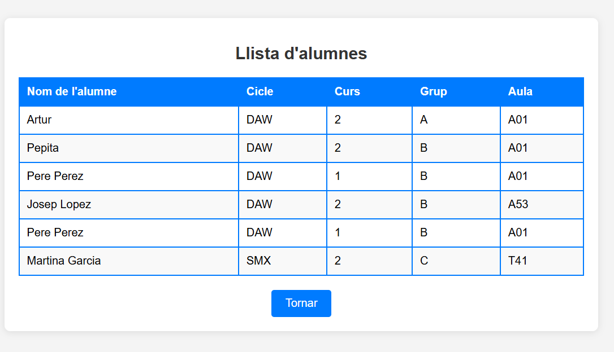
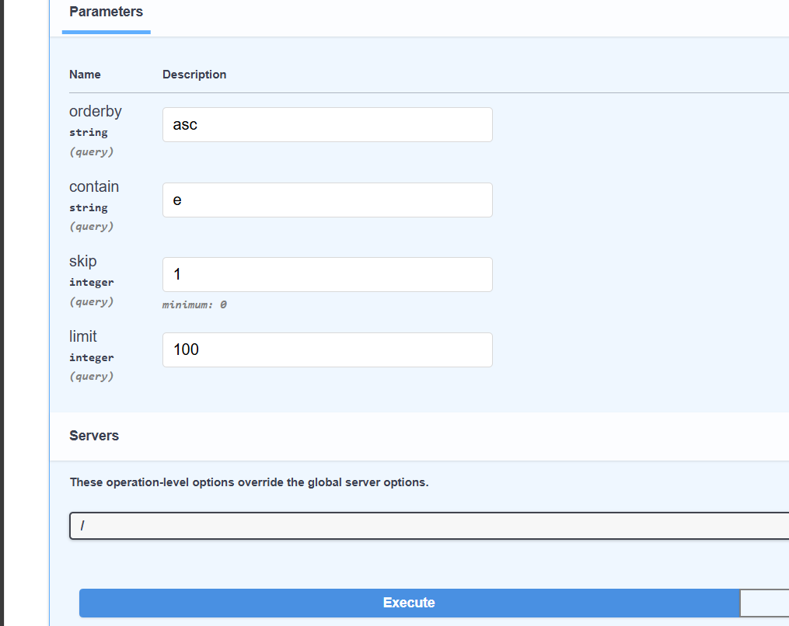
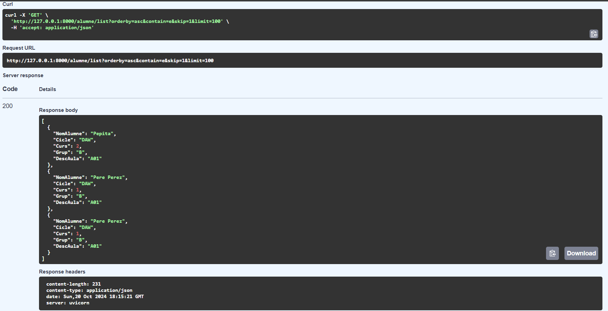
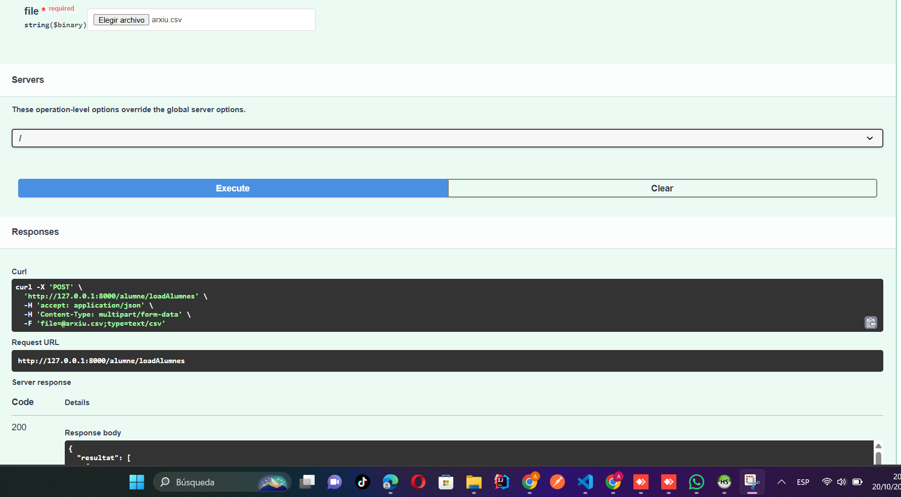
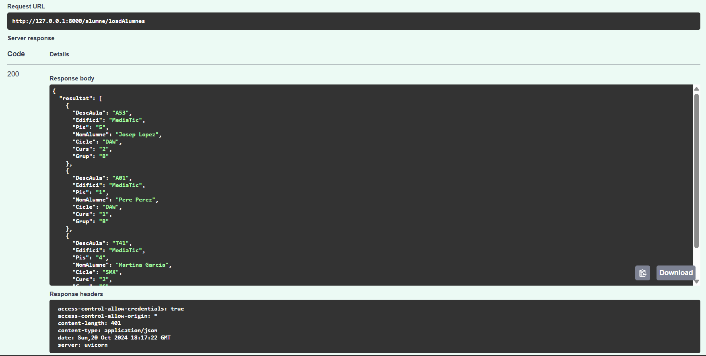
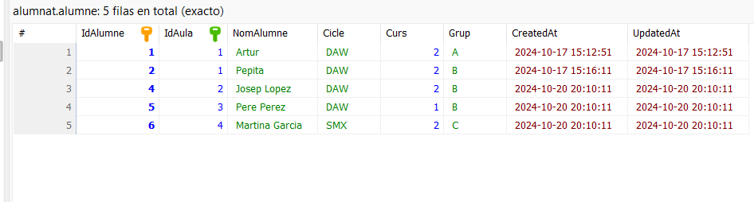
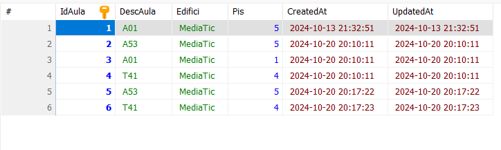

# Apartat 1: Crida de l'API des de la web
En aquest apartat l'objectiu era mostrar com des d'una pàgina web es pot cridar a un endpoint de l'API, llistar els alumnes, i mostrar les dades per pantalla quan es clica un botó.
Habia d'utilitzar el metode fetch per cridar l'endpoint /alumnes/list.
Al acabr el codi, vaig accedir a la pàgina i vaig comprovar que clicant el botó em surtia la informació dels alumnes. Aquí la captura:

# Apartat 2: Consultes Avançades
En aquest apartat, habia d'implementat diverses consultes avançades utilitzant query parametres.
## 1. Ordenació per nom d'alumne (orderby)
L'endpoint pot rebre un paràmetre orderby que accepta els valors asc o desc per retornar la llista d'alumnes ordenada per nom.

## 2. Cerca per nom (contain)
Aquest paràmetre permet retornar una llista d'alumnes on el nom contingui el text proporcionat.

## 3. Paginació (skip i limit)
Aquest paràmetre permet limitar el nombre de registres retornats i saltar una quantitat de registres especificada.
Aquí les captures:

# Apartat 3: Càrrega Massiva d'Alumnes
En aquest apartat habia d'implementat un endpoint que permet carregar alumnes i aules des d'un fitxer CSV.

He creat un endpoint que accepta fitxers CSV a través d'una petició POST i carrega alumnes i aules a la base de dades
Aquí les captures:

